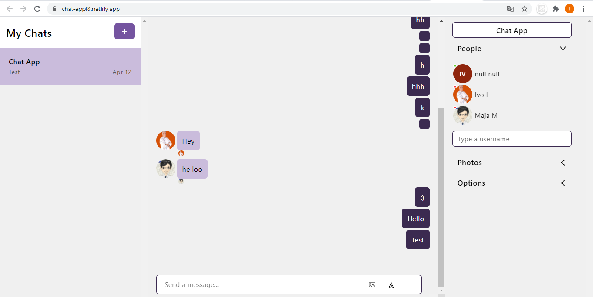

## Private chat app
 

## Table of contents
* [General info](#general-info)
* [Technologies](#technologies)
* [Deployment](#deployment)

## General info
* This project is simple React chatting app
* new users can be added 
* an icon is displayed when someone reads the message
* shows who is online
	
## Technologies
Project is created with:
* Frontend: This project was bootstrapped with Create React App - React version: 17.0.2
* Backend is hosted by https://chatengine.io​
	
## Deployment

* Available at https://chat-appl8.netlify.app/

